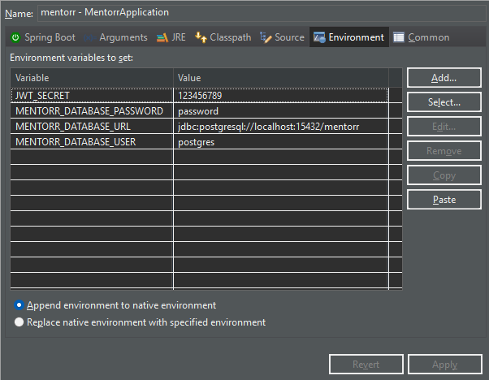

# mentorr
**Projeto de Pós-graduação na UniFAP** 

Um MVP de uma plataforma web que possibilita a conexão entre alunos e mentores.

## Tecnologias utilizadas

### Front-end

* [Node.js 14.17.0](https://nodejs.org/pt/download)
* [Angular 12](https://www.npmjs.com/package/@angular/cli/v/14.2.7)

### Back-end

* [Java 11](https://www.oracle.com/java/technologies/downloads/#java11-windows)

### Banco de dados

* [PostgreSQL 12](https://sbp.enterprisedb.com/getfile.jsp?fileid=1259097)

## Instalação

### Front-end

1. Instale o **node.js** na versão recomendada;
2. Execute os comandos:
    ```bash
    cd web
    npm install
    # Aguarde...
    npm start
    ```

3. **Pronto!** O site estará disponível em [localhost:4200](http://localhost:4200/).

### Back-end

1. Instale o **Java** na versão recomendada;
2. Instale e abra o [**Spring Tools Suite**](https://spring.io/tools);

3. Selecione o _workspace_ como a pasta do **mentorr**;

4. Vá em **File > Import > Maven > Existing Maven Projects** e no '_browse_', selecione a pasta **api** e clique em **Finish**;
5. Vá em **Help > Install New Software** e adicione o **lombok** colando o link do [website](https://projectlombok.org/p2) dele no campo de texto;

6. Clique com o botão direito no projeto e vá em **Run As** > **Run Configurations**;

7. Na aba `Main type`, selecione _com.projeto.mentorr.MentorrApplication_;
8. Na aba `Profile`, coloque '_dev_';
9. Na aba `Enviroment`, adicione os _secrets_. Exemplo abaixo com o **PostgreSQL**:
    
    

10. Clique **Apply** > **Run**;
11. **Pronto!** As rotas estarão visíveis em [localhost:8780](http://localhost:8780/swagger-ui/index.html).

### Banco de Dados

> Eu ainda vou adicionar um arquivo de importação para auxiliar nessa etapa...

1. Popule a tabela `roles`, com os dados:
    | id | name        |
    |----|-------------|
    | 1  | ROLE_GESTAO |
    | 2  | ROLE_ALUNO  |
    | 3  | ROLE_MENTOR |

2. Popule a tabela `tags`, com alguns dados. Exemplos:
    | id | nome         |
    |----|--------------|
    | 1  | ux/ui design |
    | 2  | back-end     |
    | 3  | front-end    |
    | 4  | devops       |
    | 5  | agile        |

3. **Pronto!** Agora você pode criar contas de usuários, como aluno ou mentor e explorar o sistema. **Valeu!!!**